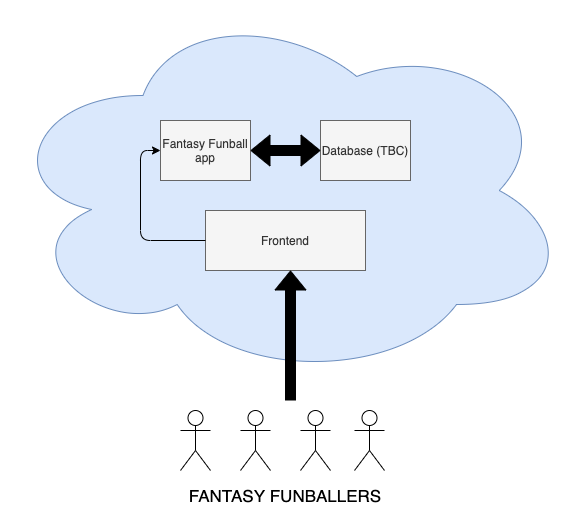

# Fantasy Funball 2: Electric Boogaloo

[](http://fantasy-funball-streamlit.herokuapp.com/)


## Setup
### Python Environment
Consider using a virtual environment; navigate to `fantasy_funball` directory and:
```python -m venv <virtual env name>```

Once set up, install required packages using requirements.txt
`pip install -r requirements.txt`. Please add to this as you need more packages.

### Database Setup
To run database locally, use Docker :whale:. Install both 
[Docker](https://docs.docker.com/get-docker/) and 
[Docker Compose](https://docs.docker.com/compose/install/). Then navigate to 
`fantasy_funball` directory and `docker-compose up`. Voila Postgres instance up and 
running. You can now mess around with your local Postgres instance. If you want to
reset & add test data, run `fantasy_funball/scripts/setup_database.py`

Alternatively, you could install PostgreSQL locally, and fill out the environment
variables within `.env` to point at your local postgres db

### Environment Variables
Environment variables needed are listed in `.env.sample`. Make a copy called `.env`.
You'll need to add your Postgres creds here.
If running PyCharm, get the `EnvFile` plugin, which allows you to attach an `.env` file to any run
configuration.

## Notes
Project has been set up with a default Django template, as both backend (this repo) 
and frontend are currently hosted with Heroku (in the :cloud:).
`core/` contains generic django files, whereas `fantasy_funball/` contains the bulk
of the application code.

## Basic Idea / Structure


## Todo
- Logic to get determine weekly results, scorers, assisters & update standings at the end of each gameweek
- Bulk out tests (both unit and functional)
- Pull down lineups etc - Can be done with FPL API?
- Random team/player if funballer doesn't choose before deadline
